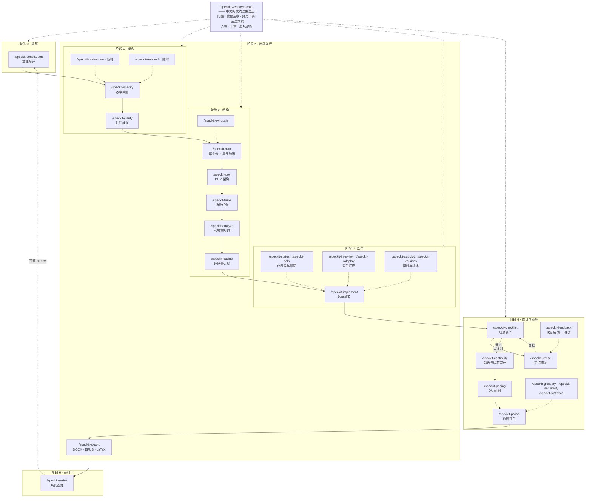

# Chinese Web Fiction Writing — Spec Kit 中文网文预设

> English version: [README.md](README.md)

面向**中文长篇网文（平台连载向）**的 [Spec Kit](https://github.com/github/spec-kit) 预设。完整保留 [fiction-book-writing](https://github.com/adaumann/speckit-preset-fiction-book-writing) v1.9.1 的小说工作流（多 POV、情节结构、文风模式、KDP 导出），并新增一套**中文网文商业写法技能树**（`speckit-webnovel-craft`）：门面工程（书名/简介/章标）、黄金三章、爽点密度节奏、三层大纲与升级体系、人物系统、章节微操、新人十大死法诊断——另附 1.2 万字调研手册《网文爆款写作实操手册》。

---

## 预设内容

```
chinese-web-fiction-writing/   ← 可通过 specify preset add 安装的预设目录
├── preset.yml                 — 预设清单
├── commands/                  — 35 个 AI 斜杠命令（34 个工作流命令 + speckit.webnovel-craft）
├── templates/                 — 26 个故事文档模板（人物、世界观、时间线等）
├── scripts/                   — 导出脚本（DOCX/EPUB/LaTeX）+ 网文技能安装脚本
└── skills/
    └── speckit-webnovel-craft/    — 网文技法技能树
        ├── SKILL.md               — 路由层（按场景分发）
        ├── subskills/             — 7 个二级技能
        │   ├── webnovel-packaging   书名 / 简介 / 封面方向 / 章标
        │   ├── webnovel-opening     黄金三章 + 十条自检表
        │   ├── webnovel-pacing      爽点密度 / 糖葫芦串 / 期待感 / 反转 / 高潮
        │   ├── webnovel-outline     三层大纲 / 升级体系 / 卷纲模板 / 卡文应对
        │   ├── webnovel-characters  主角三锚点 / 金手指 / 反派层级 / 配角反应
        │   ├── webnovel-chapter     单章结构 / 章末钩子 / 文笔微操
        │   └── webnovel-pitfalls    十大死法诊断 + 核心公式速查卡
        └── ref/
            └── 网文爆款写作实操手册.md  — 完整方法论（选题、签约、运营、30 天计划）
```

## 安装

### 从零开始 —— 一键初始化

前置条件：Python 3.10+ 和 [uv](https://docs.astral.sh/uv/)（可用 `pip install uv` 或 `winget install astral-sh.uv` 安装）。

```bash
# 1. 安装 Spec Kit CLI（>= 0.5.0）
uv tool install specify-cli --from git+https://github.com/github/spec-kit.git

# 2. 初始化一个新小说项目——按提示选择 AI agent（如 Trae）和脚本类型
specify init my-novel
cd my-novel

# 3. 一键加装本预设
specify preset add --from https://github.com/sigentech/speckit-preset-chinese-web-fiction-writing/releases/latest/download/chinese-web-fiction-writing.zip

# 4. 安装网文技能树到 .trae/skills/（执行一次，让 agent 可自动调用）
#    Windows (PowerShell):
.specify/presets/chinese-web-fiction-writing/scripts/powershell/install-webnovel-skill.ps1
#    macOS / Linux:
bash .specify/presets/chinese-web-fiction-writing/scripts/bash/install-webnovel-skill.sh
```

完成——在你的 AI agent 中打开 `my-novel`，从 `/speckit-constitution` 开始（见下方快速开始）。

> 不想常驻安装 CLI？第 1–2 步可用单发方案：`uvx --from git+https://github.com/github/spec-kit.git specify init my-novel`。也可以用 pip：`pip install git+https://github.com/github/spec-kit.git`。

### 已安装 Spec Kit？

```bash
specify init my-novel
cd my-novel
specify preset add --from https://github.com/sigentech/speckit-preset-chinese-web-fiction-writing/releases/latest/download/chinese-web-fiction-writing.zip
```

**本地开发模式**（直接在本仓库上开发）：

```bash
specify preset add --dev /path/to/speckit-preset-chinese-web-fiction-writing/chinese-web-fiction-writing
```

> 第 4 步（技能安装脚本）是可选的：即使不执行，`/speckit-webnovel-craft` 命令也会自动回退到预设内置的技能树副本。

## 快速开始

标准 speckit 流水线，按顺序执行：

```
/speckit-constitution 创建我的故事圣经（Story Bible）
/speckit-specify 我要写一本修仙+资本逻辑的番茄风长篇网文
/speckit-plan
/speckit-tasks
/speckit-implement
```

网文技法随时可用（开书前、连载期、改稿、诊断）：

```
/speckit-webnovel-craft 帮我的书写 5 个书名和 3 版简介
/speckit-webnovel-craft 审查前三章，按十条自检表给结论
/speckit-webnovel-craft 最近追读掉了，诊断原因
```

当项目为中文网文时，`speckit.specify / plan / implement / polish / help` 五个命令会自动叠加网文技法清单（书名简介公式、黄金三章自检、爽点密度、单章结构、中文可读性）。

---

## 命令详解 — 全部 35 个命令

按生命周期阶段分组。各阶段大致按顺序推进；标注「随时」的命令为跨阶段工具。

### 阶段 0 · 奠基 —— 最先执行

| 命令 | 作用 | 使用时机 |
|---|---|---|
| `/speckit-constitution` | 创建故事圣经（Story Bible）：选定文风模式、情节结构、创作准则，并自动同步到所有下游模板。 | 每本书的第一条命令；全局规则变更时重新执行。 |

### 阶段 1 · 概念

| 命令 | 作用 | 使用时机 |
|---|---|---|
| `/speckit-specify` | 把自然语言创意变成故事简报：一句话梗概（logline）、人物弧光、关键场景节拍、必备情节要素。 | constitution 之后、开书第一步。 |
| `/speckit-clarify` | 检测并消除简报中的歧义——动机、时间线缺口、POV 清晰度、世界观矛盾。 | specify 之后、plan 之前；简报含糊时随时重跑。 |
| `/speckit-brainstorm` | 交互式头脑风暴，可对任意主题（简报、人物、世界观、主题、系列等）连环追问；挑战模式可压力测试已有设定。 | 卡壳时，或想验证某个设定是否站得住时。 |
| `/speckit-research` | 考据追踪：add（登记问题）/ resolve（记录结论）/ check（扫描正文中无考据支撑的断言）/ status（仪表盘）；结论会进入任务生成。 | 从构思到终稿的任何时刻。 |

### 阶段 2 · 结构

| 命令 | 作用 | 使用时机 |
|---|---|---|
| `/speckit-plan` | 基于简报 + 故事圣经生成故事结构：幕/阶段划分、章节地图、配套文档。 | specify/clarify 之后。 |
| `/speckit-pov` | 设计、审计、排期并校验 POV 架构（单 POV 或多 POV）。 | plan 期间或刚完成后、动笔之前。 |
| `/speckit-tasks` | 按幕和人物弧光生成逐场景写作任务，含考据阶段与关键检查点。 | plan 之后。 |
| `/speckit-analyze` | 动笔前结构对齐检查：简报↔计划覆盖率、幕比例、任务完整性。 | tasks 之后、**implement 之前**。 |
| `/speckit-outline` | 从 plan 生成可编辑的逐场景大纲文件，经作者逐份批准后才允许 AI 起草（或标记 SKIP 自己写）。 | analyze 之后、implement 之前。 |
| `/speckit-synopsis` | 生成一页梗概（250–350 词）与完整梗概（1000–2000 词）：现在时、第三人称、剧透结局。 | plan 之后（大纲梗概）或完稿后（精确梗概）。 |

### 阶段 3 · 起草

| 命令 | 作用 | 使用时机 |
|---|---|---|
| `/speckit-implement` | 起草场景与章节；支持探索模式（`--discovery`）、大纲跳过、声音样本校准（`--voice`）。 | 主写作循环，逐任务推进。 |
| `/speckit-status` | 项目仪表盘：字数统计、状态分布、完成度预估。 | 连载/起草期间随时查看。 |
| `/speckit-help` | 工作流顾问：扫描全部项目文件，像资深编辑一样给出下一步建议及理由。 | 不知道「接下来该干嘛」时。 |
| `/speckit-interview` | 与角色一对一沉浸式对话，挖掘心理、潜台词与弧光状态。 | 角色变扁平、或其下一步行动不明时。 |
| `/speckit-roleplay` | 多角色预演大纲或已起草章节；含对白工坊模式与潜台词追踪员。 | 写难点章节之前或之后。 |
| `/speckit-subplot` | 副线管理：add（连载中登记新副线）/ check（节拍缺口、长期缺席审计）/ status（仪表盘）/ intersect（重建交汇图）。 | 起草中期，副线新生或失控时。 |
| `/speckit-versions` | 草稿版本管理：list（版本时间线）/ diff（版本对比）/ log（修订历史）/ tag（里程碑标签）。 | 随时；大改前先打标签。 |

### 阶段 4 · 修订与质检

| 命令 | 作用 | 使用时机 |
|---|---|---|
| `/speckit-checklist` | 场景质量关卡（「散文的单元测试」）：三重目的检验、对白潜台词、感官细节、失衡结尾、圣经合规。 | 章节起草后、polish 之前。 |
| `/speckit-revise` | 只重写 checklist/continuity 标出的失败段落，不动通过的内容；出版本化草稿 + 差异摘要。 | checklist 或 continuity 报告失败时。 |
| `/speckit-continuity` | 完稿后散文分析：圣经合规、人物弧光一致性、时间线连贯、伏笔回收率。 | implement 之后——可按章或全书执行。 |
| `/speckit-pacing` | 逐章张力打分，识别平台期、中段塌陷、高潮前置；输出 Mermaid 张力曲线图 + 修复任务清单。 | implement 之后、polish/export 之前。 |
| `/speckit-glossary` | 术语权威库：add（登记术语，非英语项目必须同时登记英文规范译名）/ check（扫描违规，含 VG-006 英文译名缺失检查）/ audit（揪出未登记的自造词）/ status（仪表盘）。全局规则见 craft-rules § VII。 | 持续使用；polish 与 continuity 会强制执行。 |
| `/speckit-sensitivity` | 敏感性与呈现审查：按 CRITICAL / WARNING / NOTE 分级并给出修复建议。 | 发布前；可按章、按类别或全书执行。 |
| `/speckit-statistics` | 散文量化报告：可读性评分、句长方差、被动语态占比、副词密度、对白平衡。 | implement 或 polish 之后，获取句子级量化快照。 |
| `/speckit-polish` | 终稿行级润色：节奏、句式变化、用词重复、过滤词、副词密度、声域一致性。 | checklist 全部 PASS 之后——最后一道文字关卡。 |
| `/speckit-feedback` | 消化试读/编辑意见：按问题类型分类、映射到章节、生成优先级排序的修订任务。 | 收到 beta 读者或编辑反馈后。 |

### 阶段 5 · 出版与发行

| 命令 | 作用 | 使用时机 |
|---|---|---|
| `/speckit-export` | 将成稿章节汇编导出为 DOCX / EPUB / LaTeX（pandoc），支持 KDP、IngramSpark、Draft2Digital、Shunn 标准格式。 | polish 之后、发布时。 |
| `/speckit-cover` | 生成封面简报 + 可直接粘贴的 AI 绘图提示词 + 各平台技术规格。 | 发布与营销前。 |
| `/speckit-illustrate` | 生成内文插图简报：章节扉页图、分隔符、整页插画。 | 做插图版时。 |
| `/speckit-query` | 生成行业标准投稿信（250–350 词）并更新投稿追踪表。 | 走传统出版、向经纪人投稿时。 |
| `/speckit-bio` | 作者简介多版本：投稿版、书末版、平台资料版、社媒版、第一人称版。 | 配合投稿或平台开通时。 |
| `/speckit-audiobook` | 有声书管线：SSML 草稿、配音选角、发音词典、过期检查、制作仪表盘。 | 文字定稿后、做有声版时。 |

### 阶段 6 · 系列化

| 命令 | 作用 | 使用时机 |
|---|---|---|
| `/speckit-series` | 系列圣经管理：第 1 本前初始化、跨书连续性审计、每本完结后同步、系列仪表盘。 | 多本书项目——第 1 本之前及两书之间。 |

### 跨阶段覆盖层 —— 中文网文技法

| 命令 | 作用 | 使用时机 |
|---|---|---|
| `/speckit-webnovel-craft` | 路由到 7 个二级网文技能：门面工程（书名/简介）、黄金三章、爽点节奏、三层大纲+升级体系、人物系统、单章微操、十大死法诊断。 | 中文连载网文的任何阶段：开书前门面包装、开篇审查、连载期爽点节奏、追读下跌诊断。不适用于非网文体裁。 |

---

## 全局规则：术语表与双语记录

所有项目通用（定义于 craft-rules § VII，由 `/speckit-glossary`、`/speckit-polish`、`/speckit-continuity` 强制执行）：

1. **术语必登记** —— 小说中出现的专门术语（包括但不限于人名、地名、概念、技能、物品、势力、特性）首次出现时必须登记进 `glossary.md`。
2. **非英语创作必双语** —— 当创作语言不是英语（constitution `Language ≠ en`）时，每条术语必须同时记录**创作语言表达**和**英文规范译名**（一词一译，定下后不再变更）。
3. **目的** —— 一是保证全篇术语一致性；二是非英文书稿可以据此准确且前后一致地生成英文版小说。

---

## 全周期流程图



**读图说明**：实线箭头是主干流程（constitution → specify → plan → tasks → outline → implement → checklist → continuity → pacing → polish → export）；虚线箭头是可选或随时可用的辅助命令。`checklist → revise → checklist` 循环反复执行，直到所有场景关卡通过。`/speckit-webnovel-craft` 作为覆盖层贯穿阶段 0–4，服务于中文网文项目。多本系列由 `/speckit-series` 交接，开启新一轮循环。

---

## 与上游的关系

- 基于 [adaumann/speckit-preset-fiction-book-writing](https://github.com/adaumann/speckit-preset-fiction-book-writing) **v1.9.1**（MIT），保留其全部命令、模板与导出能力；完整命令参考见[上游 README](https://github.com/adaumann/speckit-preset-fiction-book-writing/blob/main/fiction-book-writing/README.md)。
- 本预设新增：`commands/speckit.webnovel-craft.md`、`skills/speckit-webnovel-craft/` 技能树、5 个核心命令中的中文网文扩展段、2 个技能安装脚本。
- 分工：**speckit 管工程流程**（specify → plan → tasks → implement → continuity → polish），**webnovel-craft 管网文商业写法**（门面、开篇、爽点、大纲、人物、单章、避坑）。

## 致谢

- [github/spec-kit](https://github.com/github/spec-kit) (MIT)
- [adaumann/speckit-preset-fiction-book-writing](https://github.com/adaumann/speckit-preset-fiction-book-writing) v1.9.1 (MIT)

## 许可证

MIT — 见 [LICENSE](LICENSE)。上游项目 github/spec-kit 与 speckit-preset-fiction-book-writing 同为 MIT。
