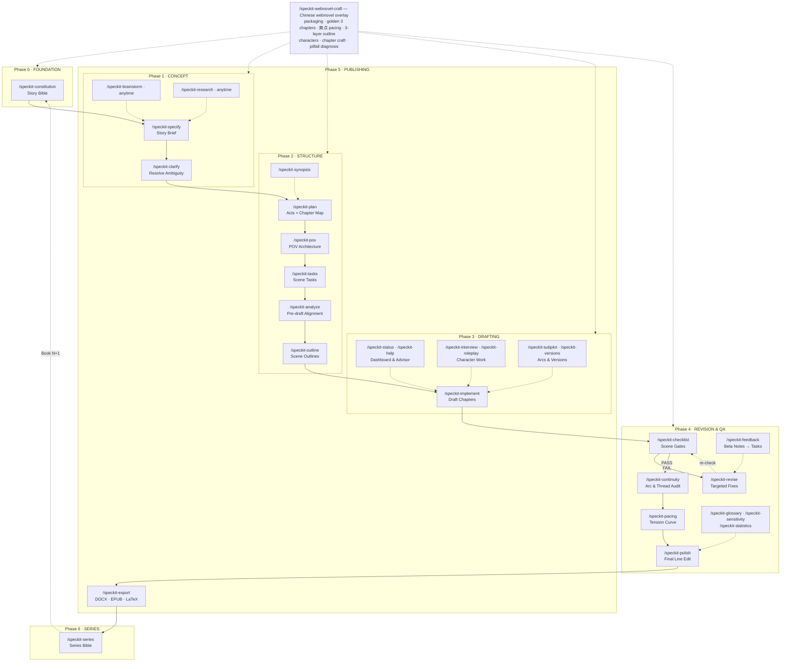

# Chinese Web Fiction Writing — Spec Kit Preset

> 中文版文档：[README_CN.md](README_CN.md)

A [Spec Kit](https://github.com/github/spec-kit) preset for **Chinese serialized web fiction** (中文网文). It bundles the complete [fiction-book-writing](https://github.com/adaumann/speckit-preset-fiction-book-writing) v1.9.1 workflow (multi-POV, plot structures, style modes, KDP export) and adds a **Chinese webnovel craft skill tree** (`speckit-webnovel-craft`): packaging (书名/简介/章标), golden three-chapter opening (黄金三章), satisfaction-point pacing (爽点密度), three-layer outline with progression system (升级体系), character system, chapter-level craft, and rookie-pitfall diagnosis (新人十大死法) — plus the 12,000-character field manual 《网文爆款写作实操手册》.

---

## Contents

```
chinese-web-fiction-writing/   ← preset directory installable via `specify preset add`
├── preset.yml                 — preset manifest
├── commands/                  — 35 AI slash commands (34 workflow + speckit.webnovel-craft)
├── templates/                 — 26 story document templates (characters, world, timeline, …)
├── scripts/                   — export scripts (DOCX/EPUB/LaTeX) + webnovel skill installer
└── skills/
    └── speckit-webnovel-craft/    — webnovel craft skill tree
        ├── SKILL.md               — router layer (dispatch by scenario)
        ├── subskills/             — 7 second-level skills
        │   ├── webnovel-packaging   title / blurb / cover direction / chapter titles
        │   ├── webnovel-opening     golden three chapters + 10-item self-check
        │   ├── webnovel-pacing      爽点 density / candied-hawthorn chaining / hooks / climaxes
        │   ├── webnovel-outline     3-layer outline / progression system / volume plans / writer's block
        │   ├── webnovel-characters  protagonist anchors / golden finger / villain tiers / supporting cast
        │   ├── webnovel-chapter     chapter structure / end-of-chapter hooks / line-level craft
        │   └── webnovel-pitfalls    10 rookie death-traps diagnosis + core formula cheat sheet
        └── ref/
            └── 网文爆款写作实操手册.md  — full methodology (topic selection, contracts, operations, 30-day plan)
```

## Installation

Requires [Spec Kit](https://github.com/github/spec-kit) >= 0.5.0 (`uv tool install specify-cli`).

**One-click install (recommended)**:

```bash
specify preset add --from https://github.com/sigentech/speckit-preset-chinese-web-fiction-writing/releases/download/v1.0.0/chinese-web-fiction-writing.zip
```

**Local development mode**:

```bash
specify preset add --dev /path/to/speckit-preset-chinese-web-fiction-writing/chinese-web-fiction-writing
```

**Run once after installation** (installs the webnovel skill tree into `.trae/skills/` so the agent can auto-invoke it):

```powershell
# Windows (PowerShell)
.specify/presets/chinese-web-fiction-writing/scripts/powershell/install-webnovel-skill.ps1
```

```bash
# macOS / Linux
bash .specify/presets/chinese-web-fiction-writing/scripts/bash/install-webnovel-skill.sh
```

> Even without this step, `/speckit-webnovel-craft` falls back to the skill tree bundled inside the preset.

## Quick Start

Standard speckit pipeline, in order:

```
/speckit-constitution Create my Story Bible
/speckit-specify I want to write a long cultivation + capital-logic webnovel for Tomato Novel
/speckit-plan
/speckit-tasks
/speckit-implement
```

Webnovel craft is available at any moment (pre-launch, serialization, revision, diagnosis):

```
/speckit-webnovel-craft Generate 5 titles and 3 blurb variants for my book
/speckit-webnovel-craft Review my first three chapters against the 10-item checklist
/speckit-webnovel-craft My follow-read rate dropped — diagnose why
```

When the project is Chinese web fiction, the five commands `speckit.specify / plan / implement / polish / help` automatically layer on webnovel craft checklists (title/blurb formulas, golden-chapter self-check, 爽点 density, chapter structure, Chinese readability).

---

## Command Reference — All 35 Commands

Commands are grouped by lifecycle phase. Phases run roughly in order; commands marked *anytime* are cross-cutting.

### Phase 0 · Foundation — run first

| Command | What it does | When to use it |
|---|---|---|
| `/speckit-constitution` | Creates the Story Bible: picks a style mode, plot structure, and craft principles, then propagates them to all downstream templates. | The very first command of every book; revisit when global rules change. |

### Phase 1 · Concept

| Command | What it does | When to use it |
|---|---|---|
| `/speckit-specify` | Turns a natural-language idea into a story brief: logline, character arcs, key scene beats, plot requirements. | Right after constitution, at the start of a book. |
| `/speckit-clarify` | Detects and resolves ambiguity in the brief — motivation, timeline gaps, POV clarity, world-building inconsistencies. | After specify, before plan; rerun whenever the brief feels fuzzy. |
| `/speckit-brainstorm` | Interactive probing Q&A on any topic (spec, characters, world, themes, series…); challenge mode stress-tests existing decisions. | Anytime you are stuck or want a decision pressure-tested. |
| `/speckit-research` | Research tracker — add / resolve / check drafts for unsupported claims / status dashboard; drives task generation. | Anytime from first concept to final polish. |

### Phase 2 · Structure

| Command | What it does | When to use it |
|---|---|---|
| `/speckit-plan` | Builds the story structure from brief + bible: act/phase breakdown, chapter map, supporting documents. | After specify/clarify. |
| `/speckit-pov` | Designs, audits, schedules, and validates POV architecture (single- or multi-POV). | During or right after plan, before drafting. |
| `/speckit-tasks` | Generates scene-by-scene writing tasks ordered by act and character arc, with research phase and checkpoints. | After plan. |
| `/speckit-analyze` | Pre-draft structural alignment: spec↔plan coverage, act proportions, task completeness. | After tasks, **before** implement. |
| `/speckit-outline` | Generates editable per-scene outline files; you approve each before AI drafting (or mark SKIP to write it yourself). | After analyze, before implement. |
| `/speckit-synopsis` | Writes a one-page (250–350 words) and a full (1,000–2,000 words) synopsis; present tense, third person, ending revealed. | After plan (outline synopsis) or after drafting (accurate synopsis). |

### Phase 3 · Drafting

| Command | What it does | When to use it |
|---|---|---|
| `/speckit-implement` | Drafts scenes and chapters; supports discovery mode (`--discovery`), outline dismissal, and voice-sample calibration (`--voice`). | The main drafting loop, task by task. |
| `/speckit-status` | Project dashboard: word counts, status breakdown, completion estimate. | Anytime during the draft. |
| `/speckit-help` | Workflow advisor: scans all project files and recommends what to do next, like a senior editor. | Anytime you wonder "what now?". |
| `/speckit-interview` | One-on-one in-character conversation that surfaces psychology, subtext, and arc state. | When a character feels flat or their next move is unclear. |
| `/speckit-roleplay` | Multi-role play-through of an outline or drafted chapter; includes Dialog Workshop mode with a Subtext Tracker. | Before or after drafting a tricky chapter. |
| `/speckit-subplot` | Subplot management — add (register mid-draft arc), check (beat gaps, absence streaks), status (dashboard), intersect (convergence map). | Mid-draft, whenever a subplot starts or drifts. |
| `/speckit-versions` | Draft version management: list, diff, log, and milestone tags. | Anytime; tag a version before major rewrites. |

### Phase 4 · Revision & QA

| Command | What it does | When to use it |
|---|---|---|
| `/speckit-checklist` | Scene quality gates ("unit tests for prose"): triple-purpose test, dialogue subtext, sensory detail, off-balance ending, bible compliance. | On drafted chapters, before polish. |
| `/speckit-revise` | Surgically rewrites only the failing passages flagged by checklist/continuity; produces a versioned draft with a diff summary. | When checklist or continuity reports failures. |
| `/speckit-continuity` | Post-draft prose analysis: story-bible compliance, character-arc consistency, timeline coherence, open-thread coverage. | After implement — per chapter or as a full pass. |
| `/speckit-pacing` | Scores per-chapter tension; detects plateaus, sagging middles, premature peaks; outputs a Mermaid tension chart + remediation tasks. | After implement, before polish/export. |
| `/speckit-glossary` | Terminology authority: add terms, check violations, audit unregistered inventions, status dashboard. | Continuously; enforced by polish and continuity. |
| `/speckit-sensitivity` | Representation review with severity tiers (CRITICAL / WARNING / NOTE) and per-issue remediation guidance. | Before publication; scope to a chapter, a category, or the full manuscript. |
| `/speckit-statistics` | Prose metrics: readability score, sentence-length variance, passive-voice %, adverb density, dialogue balance. | After implement or polish, for a quantitative snapshot. |
| `/speckit-polish` | Final line edit: rhythm, sentence variety, word repetition, filter words, adverb density, voice register. | After checklist PASS — the last prose gate. |
| `/speckit-feedback` | Ingests beta-reader / critique-partner / editor notes → categorized, chapter-mapped, prioritized revision tasks. | When beta readers or editors return notes. |

### Phase 5 · Publishing

| Command | What it does | When to use it |
|---|---|---|
| `/speckit-export` | Assembles chapters into DOCX / EPUB / LaTeX via pandoc (KDP, IngramSpark, Draft2Digital, Shunn standard). | After polish, at publishing time. |
| `/speckit-cover` | Generates a cover brief, ready-to-paste AI image prompt, and platform technical specs. | Before release and marketing. |
| `/speckit-illustrate` | Generates interior illustration briefs: chapter openers, section dividers, full-page art. | For illustrated editions. |
| `/speckit-query` | Writes an industry-standard query letter (250–350 words) and updates the submission tracker. | When querying agents (traditional publishing path). |
| `/speckit-bio` | Author bio variants: agent query, reader back matter, platform profile, social media, first-person. | Together with query or platform setup. |
| `/speckit-audiobook` | Audiobook pipeline: SSML draft, voice casting, pronunciation lexicon, staleness check, production dashboard. | After final prose, for audio editions. |

### Phase 6 · Series

| Command | What it does | When to use it |
|---|---|---|
| `/speckit-series` | Series bible management: init before Book 1, audit cross-book continuity, sync after each book, series-wide dashboard. | Multi-book projects — before Book 1 and between books. |

### Cross-cutting Overlay — Chinese Webnovel Craft

| Command | What it does | When to use it |
|---|---|---|
| `/speckit-webnovel-craft` | Routes to the 7-subskill webnovel tree: packaging (title/blurb), golden three-chapter opening, 爽点 pacing, three-layer outline + progression system, character system, chapter craft, rookie-pitfall diagnosis. | Any phase of a Chinese serialized webnovel: pre-launch packaging, opening review, serialization pacing, readership-drop diagnosis. Not for non-webnovel genres. |

---

## Full Lifecycle Flowchart



**How to read it**: solid arrows are the mandatory spine (constitution → specify → plan → tasks → outline → implement → checklist → continuity → pacing → polish → export). Dotted arrows are optional or anytime commands that feed into a phase. The `checklist → revise → checklist` loop repeats until every scene gate passes. `/speckit-webnovel-craft` overlays phases 0–4 for Chinese webnovel projects. For multi-book series, `/speckit-series` hands off to a new book and the cycle restarts.

---

## Relationship to Upstream

- Built on [adaumann/speckit-preset-fiction-book-writing](https://github.com/adaumann/speckit-preset-fiction-book-writing) **v1.9.1** (MIT); all of its commands, templates, and export capabilities are preserved. Full upstream command reference: [upstream README](https://github.com/adaumann/speckit-preset-fiction-book-writing/blob/main/fiction-book-writing/README.md).
- Added by this preset: `commands/speckit.webnovel-craft.md`, the `skills/speckit-webnovel-craft/` skill tree, Chinese-webnovel extension sections in 5 core commands, and 2 skill installer scripts.
- Division of labor: **speckit runs the engineering pipeline** (specify → plan → tasks → implement → continuity → polish); **webnovel-craft runs the commercial webnovel playbooks** (packaging, opening, 爽点, outline, characters, chapter, pitfalls).

## License

MIT — see [LICENSE](LICENSE). Upstream projects github/spec-kit and speckit-preset-fiction-book-writing are also MIT.
